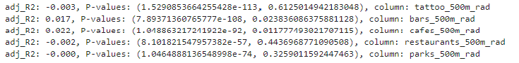
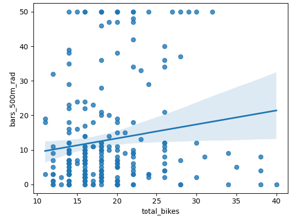
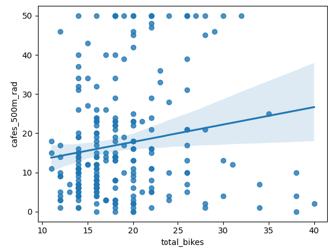
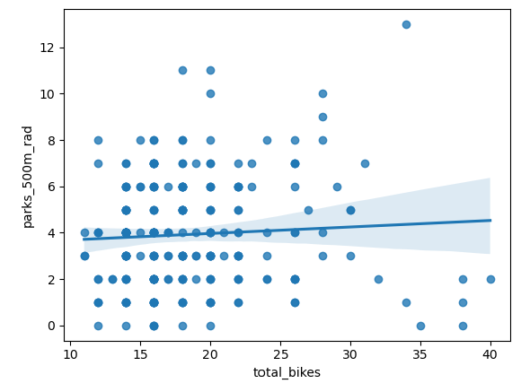
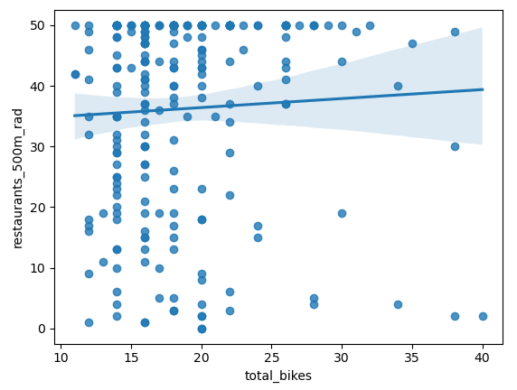
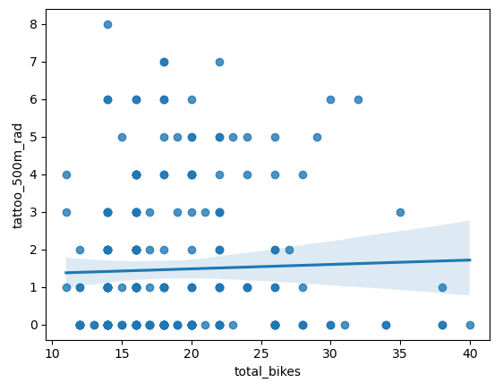

# Final-Project-Statistical-Modelling-with-Python

## Project/Goals
I chose Vancouver for my analysis. I used to live there and was an avid cyclist during that time. I speculated the more bikes per cache probably means that there are more business of interest to Vancouver bike enthusiasts. My hypothesis is that the number of bikes in a bike station would have a linear relationship with the nearby density of businesses/locations that appeal to Vancouver bikers. The business I would look at would be restaurants, bars, cafes, parks and tattoo parlours.

My goal is to draw information from the City Bikes API, Foursquare API and Yelp API, create a statistical model form the information and verify my hypothesis.

## Process
1. The first step was to extract data from city bikes API for the city of Vancouver.  The timestamp from the data incidated that this information was from Feb 13th and hadn't been updated since. Therefore I would just look at total availability per bike cache in my analysis. Furthermore every bike cache in vancouver offered e bike rentals so this wasn't a significant metric for the analysis either. My final cleaned DataFrame from the city bikes API gave longitude, latitude, bike station name and total bike data for each bike station. I exported the data to a csv file.

2. The next step was extracting data from Yelp and Foursquare and deciding which to use for my analysis. The Yelp business API had a limit of 20 business per query and 20 business within a 500 meter radius of each bike station. Given the approach I was taking to my analysis, there is no potential relationship to be drawn between businesses within a 500 meter radius and the total bikes per bike station. Therefore I will use foursquare results for my statistical model and regression analysis.

    Foursquare provides a wider array of categories of data, but Yelp has more information about the amount of local restaurants than Foursquare.
    
    To get information about how many restaurants, bars, cafes, parks and tattoo parlours are within a 500 meter radius of each bike station I created a for loop with the API parameters inside.  The for loop looped through the latitude and longitudes for each bike station. The lat long data was in the parameters of the api request along with raidus and category data.  For the limit I used the max foursquare would output, which was 50.  All of the data was passed into dictionaries, which I later turned into DataFrames. I brought all of the data into a single Dataframe and exported it to a CSV file.

3. The next step was to join the 2 csv file and create graphs of my results.   I used seaborn plots to create linear regression plots.   It didn't look like there was a significant relationship. Results below.

4. I ran a linear regresion analysis and the results were not very significant.  The results were the best for bars and total bikes per station and cafes and total bikes per station.  Given the plot on the graph I don't think anything meaningful can be derived from the linear regression model.

## Results
Unfortunately there was no significant relationship between the total number of bikes and number of categorical businesses / locations nearby. See graphs and regression data below.

## Challenges 
 It was challenging to find a meaningful connection between the City Bikes API data and the Foursquare data.

## Future Goals
If I had more time I would look at more data from the foursquare and yelp APIs, form a new hypothesis and do another analysis.
I think it would be easier to form a meaningful relationship from the City Bikes API and FSQ API if they provided a time component to their Vancouver bike cache data. I predict there is a measurable relationship bike cache’s being empty, times of day and density of business near a bike station. 

